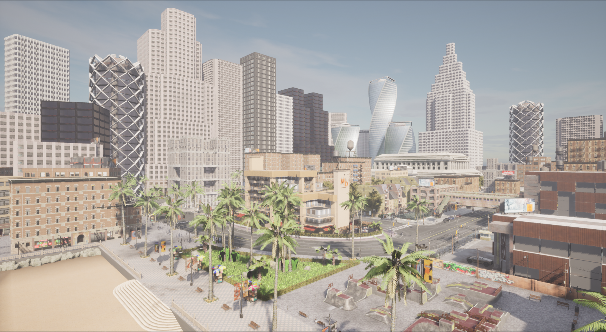

# Docker Deployment Configuration (EN)
The following describes the configuration of the project on the server side and the client in turn, in order to ensure that everything is foolproof, it is recommended to read them through.

## Server Configuration
To get started, the following requirements should be fulfilled.

* **System requirements**. Any 64-bits OS should run OpenCDA. We highly recommends Ubuntu 16.04/18.04/20.04.
* **Adequate GPU**. CARLA is a realistic simulation platform based on Unreal Engine 4, which requires at least a 3GB GPU for smooth scene rendering, though 8GB is recommended.
* **Disk Space**. Estimate 100GB of space is recommended to install CARLA and Unreal Engine.
* **Python**. Python3.8 or higher version is required for full functions.
* Carla、SUMO、PyTorch **(installed by default)**

Make sure your computer is connected to the `The Real Internet`   beforehand, as there are some relatively large packages that need to be downloaded during the build process.

For more information about the configuration of the docker image, see
[Dockerfile](Dockerfile)  

### 1. Install Vulkan Component
```shell
# Install dependencies and vulkan
sudo apt-get install cmake git gcc g++ mesa-* libwayland-dev libxrandr-dev
sudo apt-get install libvulkan1 mesa-vulkan-drivers vulkan-utils libxcb-keysyms1-dev
sudo apt-get install libxcb1-dev libx11-dev

# Verify vulkan version
vulkaninfo
```

### 2. Install NVIDIA-Docker Component
 1. [Install Docker](https://docs.docker.com/engine/install/) on your system.
 2. If you are using an Nvidia graphics card, [install the Nvidia Container Toolkit](https://docs.nvidia.com/datacenter/cloud-native/container-toolkit/install-guide.html#installation-guide). It exposes your Nvidia graphics
 card to Docker containers.
 3. Open remote display
```shell
# (Recommend) Write environment variables
echo 'xhost +' >> ~/.bashrc

# Open the container's display permissions on the host
xhost +
```
Note:
It is recommended that you restart your computer after completing the installation of the above two graphical interface components to ensure that it takes effect.

### 3. Run in docker container
In the `Dockerfile` directory, run
 ```shell
 docker build -t opencda_container .
 ```
Build Docker Container
 ```shell
 docker run --privileged --gpus all --network=host -e DISPLAY=$DISPLAY -v /usr/share/vulkan/icd.d:/usr/share/vulkan/icd.d --name opencda_container -it opencda_container:latest /bin/bash
 ```

### 4. Example
Now, you can now start the Carla server in the container you just built:
```shell
# Start the Carla server in docker container
cd carla

./CarlaUE4.sh
```
After loading for a moment, you'll see a city simulation window. Great! Using the mouse and keyboard, you can preview the scene:


## Local Client Configuration

### Python Env
**(option)**  It is highly recommended to use **Python environment management tools** such as `Conda` , It makes your expansion and development more concise.

```shell
# Download miniconda3
wget -c https://repo.anaconda.com/miniconda/Miniconda3-py38_23.1.0-1-Linux-x86_64.sh

# Install
bash ./Miniconda3-py38_23.1.0-1-Linux-x86_64.sh

# Build Python Env
conda create -n opencda python=3.8

conda activate opencda

# Go to the root directory of the OpenCDA project
pip3 install -r requirements.txt
```
For more information about `Conda`, you can refer to [here](https://docs.conda.io/projects/conda/en/latest/user-guide/install/linux.html)

### Install carla package
The carla library is contained in a .whl file in the container in the carla directory PythonAPI/carla/dist that will be used by all sample scripts.

The .whl file nomenclature follows carla-< carla-version>-py< python-version>< operating-system>.whl.

``` shell
# Note: The actual version or path prevails

# Copy the carla compilation package from the built container to the host
docker cp opencda_container:/home/carla/PythonAPI/carla/dist/carla-0.9.12-cp38-cp38-linux_x86_64.whl ./

# Install the carla package
pip3 install ./carla-0.9.12-cp38-cp38-linux_x86_64.whl
```

### Run example
```shell
# Run a single autonomous vehicle on a two-lane highway
python3 opencda.py -t single_2lanefree_carla -v 0.9.12
```
Great！You will see the following screen：


Next, you can continue to test the other [Examples provided by OpenCDA](https://opencda-documentation.readthedocs.io/en/latest/md_files/getstarted.html)

Note: Before running these examples, you need to make sure that the `Carla server` in the container is running.

## Remote Client Configuration
Please refer to the [Wiki](https://github.com/THU-MIR/OpenCDA/wiki)

