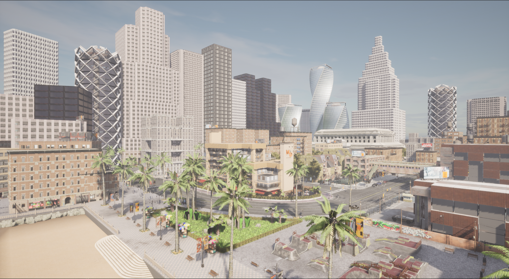
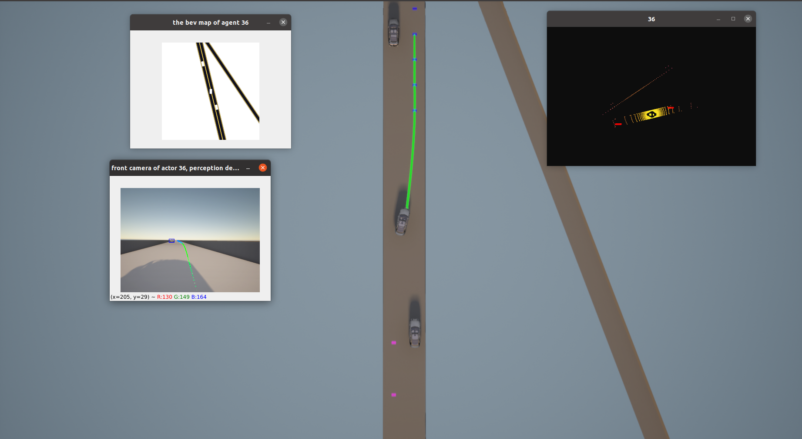

# Docker 部署配置（ZH）
下面依次介绍项目在服务端和客户端的配置，为了保证万无一失，建议事先通读它们。

## 服务端配置
* **系统需求**：Ubuntu 16.04/18.04/20.04
* **足够的GPU**：CARLA 是一个基于虚幻引擎 4 的高真实度模拟平台，建议 Nvidia 显卡和至少8G显存
* **足够的磁盘空间**：估计需要 100GB 的空间来安装 CARLA 和 Unreal Engine
* **Python**： Python3.8或更高
* Carla、SUMO、PyTorch **（默认安装）**


同时确保您的计算机能稳定的连接到 `国际互联网`，因为在构建过程中需要下载一些较大的软件包。

有关 docker 镜像构建的更多信息参考
[Dockerfile](Dockerfile)  

### 1. 安装 Vulkan 组件
```shell
# 安装依赖项以及Vulkan
sudo apt-get install cmake git gcc g++ mesa-* libwayland-dev libxrandr-dev
sudo apt-get install libvulkan1 mesa-vulkan-drivers vulkan-utils libxcb-keysyms1-dev
sudo apt-get install libxcb1-dev libx11-dev

# 验证Vulkan安装成功
vulkaninfo
```

### 2. 安装 NVIDIA-Docker 组件
 1.  在您的计算机上 [安装 Docker](https://docs.docker.com/engine/install/)
 2. 如果您使用的是 Nvidia 显卡, [安装 Nvidia Container Toolkit](https://docs.nvidia.com/datacenter/cloud-native/container-toolkit/install-guide.html#installation-guide). 您的 Nvidia 显卡即可用于支持Docker 容器
 3. 开启远程图形化显示
```shell
# (推荐) 写入到环境变量中
echo 'xhost +' >> ~/.bashrc

# 在宿主机上打开容器的显示权限
xhost +
```
注意: 建议您在完成上述两个组件的安装后重新启动计算机，以确保其生效。


### 3. 构建在 Docker 容器
进入 `Dockerfile` 所在的目录，执行： 
 ```shell
 docker build -t opencda_container .
 ```
构建 Docker 容器
 ```shell
 docker run --privileged --gpus all --network=host -e DISPLAY=$DISPLAY -v /usr/share/vulkan/icd.d:/usr/share/vulkan/icd.d --name opencda_container -it opencda_container:latest /bin/bash
 ```

### 4. 运行示例
现在，您可以在刚刚构建的容器中启动 Carla 服务器：
```shell
# 在容器中启动 Carla 服务器
cd carla

./CarlaUE4.sh
```
加载片刻后，您将看到一个城市模拟窗口，大功告成！使用鼠标和键盘可以进行场景的预览:


## 本地客户端配置

### Python 环境
**(可选)**  强烈建议使用 **Python 环境管理工具** 例如 `Conda` , 它使您的扩展和开发更加简洁。

```shell
# 下载 miniconda3
wget -c https://repo.anaconda.com/miniconda/Miniconda3-py37_23.1.0-1-Linux-x86_64.sh

# 安装
bash ./Miniconda3-py38_23.1.0-1-Linux-x86_64.sh

# 创建 Python 虚拟环境
conda create -n opencda python=3.8

conda activate opencda

# 转到 OpenCDA 项目的根目录并安装相关依赖库
pip3 install -r requirements.txt
```
更多关于 `Conda` 的使用信息, 您可以参考 [Conda用户指南](https://docs.conda.io/projects/conda/en/latest/user-guide/install/linux.html)

### 安装 carla 编译包

carla 库包含在 .whl 文件中，该文件位于容器中 carla 目录 PythonAPI/carla/dist 中，所有示例脚本都将使用它。

.whl 文件遵循 carla-<carla版本>-py<python版本>-<操作系统>.whl 的命名法。

``` shell
# 注意：以实际版本名称或路径为准

# 从已构建的容器中复制carla编译包到宿主机
docker cp opencda_container:/home/carla/PythonAPI/carla/dist/carla-0.9.12-cp38-cp38-linux_x86_64.whl ./

# 安装 carla 包
pip3 install ./carla-0.9.12-cp38-cp38-linux_x86_64.whl
```


### 运行示例
```shell
# 运行双车道高速公路上生成单个自动驾驶车辆
python3 opencda.py -t single_2lanefree_carla -v 0.9.12
```
大功告成！您将看到如下画面：


接下来您可以继续测试其他 [OpenCDA 提供的示例](https://opencda-documentation.readthedocs.io/en/latest/md_files/getstarted.html)

注意: 运行这些示例前，您需要确保容器中的 `Carla 服务器` 正在运行.

## 远程客户端配置
请参考 [Wiki](https://github.com/THU-MIR/OpenCDA/wiki)

