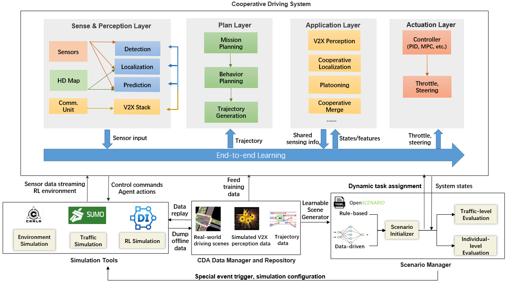

# OpenCDA

OpenCDA 是一个基于开放式协同仿真的 **研究/工程框架**，集成了原型协同驾驶自动化（CDA;参见[SAE J3216](https://www.sae.org/standards/content/j3216_202005/)）Pipeline 以及常规自动驾驶组件（例如感知、定位、规划、控制）。它不仅可以在 CARLA + SUMO 协同仿真环境中进行 CDA 评估，还可以提供丰富的 CDA 研究 Pipeline 源代码库。

OpenCDA的主要功能包括：
* <strong> 研究性 Pipeline </strong>: OpenCDA提供了丰富的研究 Pipeline（即基本和高级CDA模块的开源代码，如队列，协作感知）。
* <strong>集成化</strong>: OpenCDA分别使用CARLA和SUMO，并将它们集成在一起。
* <strong> 全栈仿真器</strong>: OpenCDA提供了一个简单的原型自动驾驶和协同驾驶平台，<strong>全部使用Python，</strong>包含感知，定位，规划，控制和V2X通信模块。
* <strong>模块化</strong>: OpenCDA高度模块化。
* <strong>提供基准</strong>: OpenCDA 提供基准测试场景、基准基线图、最先进的基准算法和基准评估指标。
* <strong>支持多机协作</strong>: OpenCDA支持CAV在仿真中各种级别和类别的合作。这使OpenCDA与其他单一车辆仿真工具区分开来。

查看 [OpenCDA 文档](https://opencda-documentation.readthedocs.io/en/latest/) 以获取更多详细信息

## 主要组件

OpenCDA 由四个主要组件组成：<strong>协同驱动系统</strong>，<strong>协同仿真工具</strong>，<strong>数据管理器和存储库</strong>以及<strong>场景管理器</strong>。

## 如何使用

 

### 用户手册
* [项目总览](https://opencda-documentation.readthedocs.io/en/latest/md_files/introduction.html)
* [Docker 部署](DockerDeployment_ZH.md)
* [快速开始](https://opencda-documentation.readthedocs.io/en/latest/md_files/getstarted.html)
* [逻辑流程图](https://opencda-documentation.readthedocs.io/en/latest/md_files/logic_flow.html)
* [交通流生成指南](https://opencda-documentation.readthedocs.io/en/latest/md_files/traffic_generation.html)

注意：我们不断提高OpenCDA的性能。目前，它主要在我们的定制地图和
 `Carla Town06 Map`; 因此，我们<strong>不保证</strong>在其他地图中具有相同级别的鲁棒性。

### 开发指南

*  [类设计](https://opencda-documentation.readthedocs.io/en/latest/md_files/developer_tutorial.html)
*  [自定义您的算法](https://opencda-documentation.readthedocs.io/en/latest/md_files/customization.html)
*  [API 手册](https://opencda-documentation.readthedocs.io/en/latest/modules.html)  
